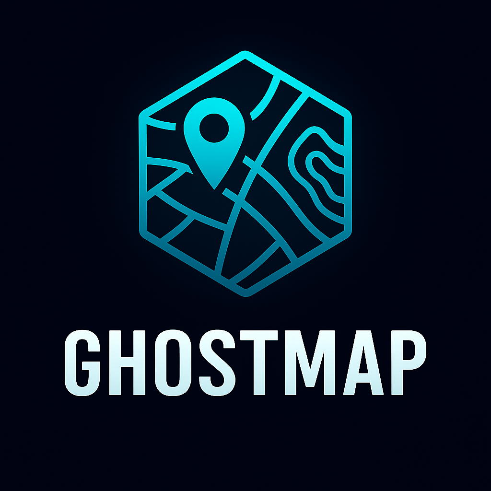

# ghostmap



[](https://ziglang.org/)
[](https://ziglang.org/download/)
[](https://geojson.org/)
[](https://en.wikipedia.org/wiki/Web_Mercator_projection)

## DISCLAIMER

⚠️ **EXPERIMENTAL LIBRARY - FOR LAB/PERSONAL USE** ⚠️

This is an experimental library under active development. It is
intended for research, learning, and personal projects. The API is subject
to change!

GhostMap is a high-performance Geographic Information System (GIS) library written in Zig, providing comprehensive spatial data processing, mapping, and geospatial analysis capabilities.

## Features

### Coordinate Systems & Projections
- WGS84 geographic coordinates with validation
- Web Mercator projection for web mapping
- Support for multiple coordinate reference systems (CRS)
- Datum conversions and transformations

### Vector Data
- Point, LineString, Polygon geometries
- Multi-part geometries (MultiPoint, MultiLineString, MultiPolygon)
- Geometry collections and feature collections
- Spatial relationships and topology operations
- Polygon area calculation, line intersection

### Raster Data
- Basic raster data structures for elevation and imagery
- Geographic bounds and coordinate mapping
- Get/set operations for raster data

### Spatial Operations
- Distance calculations (Haversine, Vincenty)
- Point-in-polygon testing (ray casting algorithm)
- Intersection, union, and difference operations
- Buffering, convex hulls, and spatial joins
- Routing and network analysis

### File Formats
- **GeoJSON**: Full read/write support for geometries and features
- **Shapefile**: Planned support for ESRI Shapefile format
- **KML/KMZ**: Google Earth formats
- **GeoTIFF**: Georeferenced raster data
- **GPX**: GPS track data

### Performance & Safety
- Zero-cost abstractions with Zig's comptime
- Memory-safe operations with explicit allocators
- SIMD-accelerated computations where applicable
- Thread-safe algorithms for concurrent processing

## Installation

### Using Zig Fetch

The easiest way to add GhostMap to your project is using Zig's package manager:

```bash
zig fetch --save https://github.com/ghostkellz/ghostmap/archive/refs/heads/main.tar.gz
```

This will automatically add the dependency to your `build.zig.zon` file with the correct hash.

### Manual Installation

If you prefer manual setup, add GhostMap to your `build.zig.zon`:

```zig
.{
    .name = "your-project",
    .version = "0.1.0",
    .dependencies = .{
        .ghostmap = .{
            .url = "https://github.com/ghostkellz/ghostmap/archive/refs/heads/main.tar.gz",
            .hash = "TODO: run zig build and update with the actual hash",
        },
    },
}
```

Then in your `build.zig`:

```zig
const ghostmap = b.dependency("ghostmap", .{});
exe.root_module.addImport("ghostmap", ghostmap.module("ghostmap"));
```

## Quick Start

See the [Getting Started Guide](docs/getting-started.md) for detailed installation and usage instructions.

## Usage

```zig
const std = @import("std");
const ghostmap = @import("ghostmap");

pub fn main() !void {
    // Create a point
    const point = try ghostmap.Point.init(40.7128, -74.0060);
    
    // Project to Web Mercator
    const mercator = ghostmap.projectToWebMercator(point);
    
    // Parse GeoJSON
    const json = "{\"type\":\"Point\",\"coordinates\":[-74.006,40.7128]}";
    const parsed = try ghostmap.parseGeoJSONPoint(std.heap.page_allocator, json);
    
    // Calculate distance
    const distance = point.distance(parsed);
    
    std.debug.print("Distance: {d} km\n", .{distance});
}
```

For more examples, see the [Examples](docs/examples.md) documentation.

## API Reference

For detailed API documentation, see the [API Reference](docs/api-reference.md).

## Contributing

Contributions are welcome! Please see the [Contributing Guide](docs/contributing.md) for development setup and guidelines.

## License

This project is licensed under the MIT License - see the [LICENSE](LICENSE) file for details.

Built with ⚡ Zig
